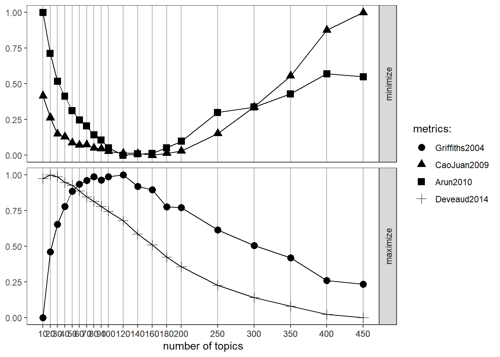
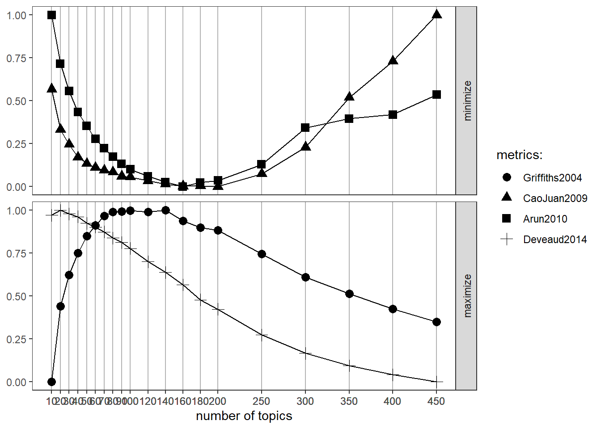

```{r setup, include=FALSE}
knitr::opts_chunk$set(echo = TRUE)
setwd("D:\\Office\\Arbeit\\pubs\\zfs")
require(readr)
require(data.table)
require(dplyr)
require(writexl)
require(ggplot2)
require(tidytext)
require(quanteda)
require(topicmodels)
require(tm)
require(ldatuning)
require(knitr)
require(kableExtra)
require(stringr)
```

# Vorab-Infos
Die folgenden Daten habe ich neu aus dem Web-of-Science gezogen. Heißt: Auch unsere ursprüngliche Rechnung (**Modell 7**) hat sich in Fallzahl geändert - von knapp 190 auf 300! Die meisten der hinzugekommenen Papers handeln über Covid. Das war irgendwie abzusehen. Ich gehe auch verschiedene Daten-Konstellationen aus dem Web-of Science ein. Bei jedem Modell ist die Datenbank, Suchbegriffe und die Fallzahl vermerkt. Zur Erinnerung: ∨ heißt "oder", ∧ heißt "und". Die hinzunahme von den vorgeschlagenen Wörtern findet in **Modell 8** statt. Die anderen Modelle sind unterschiedliche Kombinationen und Datensätze.


[Ich versuche empirisch die beste Zahl der Topics zu ermitteln.](https://cran.r-project.org/web/packages/ldatuning/vignettes/topics.html) Dabei kommen vier Angaben vor, von denen jeweils zwei zu minimieren und maximieren sind:

+ Minimize
  - [Arun2010](https://link.springer.com/chapter/10.1007%2F978-3-642-13657-3_43): Produziert zwei Korpi aus dem bestehenden Korpus und performt ein Topic-Modelling für beide. Über Kullback-Leibler-Divergenz, wird die Abweichung der beiden Wahrscheinlichkeitsmodelle geprüft. Je ähnlicher, also geringer, desto besser. Sprich, dieses Maß favorisiert konsistenz. 
  - [CaoJuan2009](https://www.sciencedirect.com/science/article/abs/pii/S092523120800372X?via%3Dihub): Dieses Maß bevorzugt statistische "Dichte". Sprich eine Zahl von Topics wird favorisiert, mit maximaler Kohärenz innerhalb eiens Topics (Intrakorrelation hoch) und Distinktivität zwischen Topics (Interkorrelation niedrig). Dies wird bewerkstelligt, indem eine Zahl Topics gewählt wird, welche die Ähnlichkeit von Topics minimiert (Perplexity und Distance).
+ Maximize
  - [Griffiths2004](https://www.pnas.org/content/101/suppl_1/5228): Versucht die log-likelihood, dass ein Wort auf einem Topic "lädt" zu maximieren ($logP(w|T)$)
  - [Deveaud2014](https://dn.revuesonline.com/article.jsp?articleId=19419): Versucht die Divergenz an Informationen zwischen Topic-Nummern zu maximieren. Sprich, es favorisiert Distinktion zwischen Topics.
Diese Berechnungen sind immer relativ zum Startwert. Also nicht wundern, warum die Ergebnisse beim Startwert am höchsten sind und dann abflachen. Muss nicht immer sein, aber in diesem Fall ist es schon so.

Für Modelle wo ich es wichtig finde, stelle ich auch die Top10 Wörter der jeweiligen Topics dar. **Wichtig: Diese Berechnungen sind nur Hilfen. Jeder Data Scientist stimmt hier überein: Es gibt kein goodness-of-fit, welches uns schlagende Ergebnisse geben kann oder sollte. Beim Topic Modelling, wie auch anderen ähnlichen Analyseverfahren, geht es um die Fähigkeit des Betrachters die Cluster auch interpretieren zu können.**

# Modell 1
**Datenbank**: SSCI <br>
**Search Terms**: (digital\* ∨ online\* ∨ internet\*) ∧ ineq\* <br>
**Fallzahl**: 2.578

## Datenpräperation
```{r Datenpräperation Model 1}
# Wir kreieren den zu modellieren Text aus Titel und Abstrakt
ssci_3_ineq <- readRDS("D:/Office/Arbeit/pubs/zfs/ssci_3_ineq/ssci_3_ineq.rds")
ssci_3_ineq$text <- paste(ssci_3_ineq$ti, ssci_3_ineq$ab, sep=" ") ## Concat.
mod1_text <- ssci_3_ineq$text ## Als eigener Vektor

# Hier wird sauber gemacht
mod1_text  <- tolower(mod1_text) ## Kleinbuchstaben
mod1_text  <-  removeWords(mod1_text, tm::stopwords("en")) ## Remove stopwords
print(tm::stopwords("en")) ## Folgende stopwords wurden entfernt
mod1_text  <-  gsub("’", "'", mod1_text) ## Falsche Apostrophe ausgetauscht
mod1_text  <-  gsub("-", " ", mod1_text) ## Bindestriche mit Leerzeichen ausgetauscht
mod1_text  <-  gsub("[\r\n]", "", mod1_text) ## Zeilenumbrüche entfernt
mod1_text  <-  gsub("[[:punct:]]", "", mod1_text) ## Sonderzeichen entfernt
mod1_text  <-  gsub("covid 19", "covid19", mod1_text) ## Spezialfall
mod1_text  <-  gsub("[[:digit:]]+", "", mod1_text) ## Zahlen entfernt
mod1_text  <- str_squish(mod1_text) ## Doppelte Leerzeichen entfernt

# Umwandlung in Dokument-Term-Matrx(DTM)
corp <- Corpus(VectorSource(mod1_text))
dtm <- DocumentTermMatrix(corp)

# Angemessene Zahl an Topics finden
result <- FindTopicsNumber(
  dtm,
  topics = seq(from = 2, to = 15, by = 1),
  metrics = c("Griffiths2004", "CaoJuan2009", "Arun2010", "Deveaud2014"),
  method = "Gibbs",
  control = list(seed = 77),
  mc.cores = 4L,
  verbose = TRUE
)

FindTopicsNumber_plot(result)
## 13 Topics scheinen am besten
```

## Topic-Modelling
```{r Topic Modelling Model 1}
# LDA
topics <- LDA(dtm, k = 13, control = list(seed = 77))

# Clean-Up/Beta(also Prob.) extrahieren
wos_topics <- tidy(topics, matrix="beta")

# Top-10 Wörter je Topic
wos_top_terms <-
  wos_topics %>%
  group_by(topic) %>%
  top_n(10, beta) %>%
  ungroup() %>%
  arrange(topic, -beta)

# Darstellung
wos_top_terms[1:40,] %>%
  mutate(term=reorder(term, beta)) %>%
  mutate(topic = paste("Topic #", topic)) %>%
  ggplot(aes(term, beta, fill=factor(topic))) +
  geom_col(show.legend = FALSE) +
  facet_wrap(~ topic, scales="free") +
  theme_minimal()+
  theme(plot.title = 
          element_text(hjust=0.5, size=18)) +
  labs(title = "Topic Model von SSCI Beiträgen",
       caption = "Top Begriffe nach Topic (beta)"
       ) +
  ylab("") +
  xlab("") +
  coord_flip()

wos_top_terms[41:80,] %>%
  mutate(term=reorder(term, beta)) %>%
  mutate(topic = paste("Topic #", topic)) %>%
  ggplot(aes(term, beta, fill=factor(topic))) +
  geom_col(show.legend = FALSE) +
  facet_wrap(~ topic, scales="free") +
  theme_minimal()+
  theme(plot.title = 
          element_text(hjust=0.5, size=18)) +
  labs(title = "Topic Model von SSCI Beiträgen",
       caption = "Top Begriffe nach Topic (beta)"
       ) +
  ylab("") +
  xlab("") +
  coord_flip()


wos_top_terms[81:nrow(wos_top_terms),] %>%
  mutate(term=reorder(term, beta)) %>%
  mutate(topic = paste("Topic #", topic)) %>%
  ggplot(aes(term, beta, fill=factor(topic))) +
  geom_col(show.legend = FALSE) +
  facet_wrap(~ topic, scales="free") +
  theme_minimal()+
  theme(plot.title = 
          element_text(hjust=0.5, size=18)) +
  labs(title = "Topic Model von SSCI Beiträgen",
       caption = "Top Begriffe nach Topic (beta)"
       ) +
  ylab("") +
  xlab("") +
  coord_flip()
```

# Modell 2
**Datenbank**: SSCI <br>
**Search Terms**: (digital\* ∨ online\* ∨ internet\*) ∧ (ineq\* ∨ diversity ∨ intersectional\*) <br>
**Fallzahl**: 5.648

## Datenpräperation
```{r Datenpräperation Model 2}
# Wir kreieren den zu modellieren Text aus Titel und Abstrakt
rm(list = ls())
ssci_3_ineq3 <- readRDS("D:/Office/Arbeit/pubs/zfs/ssci_3_ineq3/ssci_3_ineq3.rds")
ssci_3_ineq3$text <- paste(ssci_3_ineq3$ti, ssci_3_ineq3$ab, sep=" ") ## Concat.
mod2_text <- ssci_3_ineq3$text ## Als eigener Vektor

# Hier wird sauber gemacht
mod2_text  <- tolower(mod2_text) ## Kleinbuchstaben
mod2_text  <-  removeWords(mod2_text, tm::stopwords("en")) ## Remove stopwords
mod2_text  <-  gsub("’", "'", mod2_text) ## Falsche Apostrophe ausgetauscht
mod2_text  <-  gsub("-", " ", mod2_text) ## Bindestriche mit Leerzeichen ausgetauscht
mod2_text  <-  gsub("[\r\n]", "", mod2_text) ## Zeilenumbrüche entfernt
mod2_text  <-  gsub("[[:punct:]]", "", mod2_text) ## Sonderzeichen entfernt
mod2_text  <-  gsub("covid 19", "covid19", mod2_text) ## Spezialfall
mod2_text  <-  gsub("[[:digit:]]+", "", mod2_text) ## Zahlen entfernt
mod2_text  <- str_squish(mod2_text) ## Doppelte Leerzeichen entfernt

# Umwandlung in Dokument-Term-Matrx(DTM)
corp <- Corpus(VectorSource(mod2_text))
dtm <- DocumentTermMatrix(corp)

# Angemessene Zahl an Topics finden. Vorabtest ergab 20 als optimale Zahl. Wir testen das mal!
result <- FindTopicsNumber(
  dtm,
  topics = seq(from = 20, to = 40, by = 1),
  metrics = c("Griffiths2004", "CaoJuan2009", "Arun2010", "Deveaud2014"),
  method = "Gibbs",
  control = list(seed = 77),
  mc.cores = 4L,
  verbose = TRUE
)

FindTopicsNumber_plot(result)
## 38 o. 40 Topics scheinen am besten
```

## Topic-Modelling
```{r Topic Modelling Model 2}
# LDA
topics <- LDA(dtm, k = 38, control = list(seed = 77))

# Clean-Up/Beta(also Prob.) extrahieren
wos_topics <- tidy(topics, matrix="beta")

# Top-10 Wörter je Topic
wos_top_terms <-
  wos_topics %>%
  group_by(topic) %>%
  top_n(10, beta) %>%
  ungroup() %>%
  arrange(topic, -beta)

# Darstellung
wos_top_terms[1:90,] %>%
  mutate(term=reorder(term, beta)) %>%
  mutate(topic = paste("Topic #", topic)) %>%
  ggplot(aes(term, beta, fill=factor(topic))) +
  geom_col(show.legend = FALSE) +
  facet_wrap(~ topic, scales="free") +
  theme_minimal()+
  theme(plot.title = 
          element_text(hjust=0.5, size=18)) +
  labs(title = "Topic Model von SSCI Beiträgen",
       caption = "Top Begriffe nach Topic (beta)"
       ) +
  ylab("") +
  xlab("") +
  theme(axis.text=element_text(size=8)) +
  coord_flip()

wos_top_terms[91:180,] %>%
  mutate(term=reorder(term, beta)) %>%
  mutate(topic = paste("Topic #", topic)) %>%
  ggplot(aes(term, beta, fill=factor(topic))) +
  geom_col(show.legend = FALSE) +
  facet_wrap(~ topic, scales="free") +
  theme_minimal()+
  theme(plot.title = 
          element_text(hjust=0.5, size=18)) +
  labs(title = "Topic Model von SSCI Beiträgen",
       caption = "Top Begriffe nach Topic (beta)"
       ) +
  ylab("") +
  xlab("") +
  theme(axis.text=element_text(size=8)) +
  coord_flip()


wos_top_terms[181:270,] %>%
  mutate(term=reorder(term, beta)) %>%
  mutate(topic = paste("Topic #", topic)) %>%
  ggplot(aes(term, beta, fill=factor(topic))) +
  geom_col(show.legend = FALSE) +
  facet_wrap(~ topic, scales="free") +
  theme_minimal()+
  theme(plot.title = 
          element_text(hjust=0.5, size=18)) +
  labs(title = "Topic Model von SSCI Beiträgen",
       caption = "Top Begriffe nach Topic (beta)"
       ) +
  ylab("") +
  xlab("") +
  theme(axis.text=element_text(size=8)) +
  coord_flip()

wos_top_terms[270:nrow(wos_top_terms),] %>%
  mutate(term=reorder(term, beta)) %>%
  mutate(topic = paste("Topic #", topic)) %>%
  ggplot(aes(term, beta, fill=factor(topic))) +
  geom_col(show.legend = FALSE) +
  facet_wrap(~ topic, scales="free") +
  theme_minimal()+
  theme(plot.title = 
          element_text(hjust=0.5, size=18)) +
  labs(title = "Topic Model von SSCI Beiträgen",
       caption = "Top Begriffe nach Topic (beta)"
       ) +
  ylab("") +
  xlab("") +
  theme(axis.text=element_text(size=8)) +
  coord_flip()
```

# Modell 3
**Datenbank**: SSCI <br>
**Search Terms**: (digital\* ∨ online\* ∨ internet\*) ∧ (ineq\* ∨ diversity ∨ intersectional\* ∨ unequal\*) <br>
**Fallzahl**: 5.875

**Aufgrund der Fallzahl verzichte ich ab hier auf die Darstellung von Daten mit gleicher oder größerer Fallzahl!**

## Datenpräperation und Topic-Zahl-Bestimmung Model 3
```{r Datenpräperation Model 3, eval=FALSE}
# Wir kreieren den zu modellieren Text aus Titel und Abstrakt
rm(list = ls())
ssci_3_ineq4 <- readRDS("D:/Office/Arbeit/pubs/zfs/ssci_3_ineq4/ssci_3_ineq4.rds")
ssci_3_ineq4$text <- paste(ssci_3_ineq4$ti, ssci_3_ineq4$ab, sep=" ") ## Concat.
mod3_text <- ssci_3_ineq4$text ## Als eigener Vektor

# Hier wird sauber gemacht
mod3_text  <- tolower(mod3_text) ## Kleinbuchstaben
mod3_text  <-  removeWords(mod3_text, tm::stopwords("en")) ## Remove stopwords
mod3_text  <-  gsub("’", "'", mod3_text) ## Falsche Apostrophe ausgetauscht
mod3_text  <-  gsub("-", " ", mod3_text) ## Bindestriche mit Leerzeichen ausgetauscht
mod3_text  <-  gsub("[\r\n]", "", mod3_text) ## Zeilenumbrüche entfernt
mod3_text  <-  gsub("[[:punct:]]", "", mod3_text) ## Sonderzeichen entfernt
mod3_text  <-  gsub("covid 19", "covid19", mod3_text) ## Spezialfall
mod3_text  <-  gsub("[[:digit:]]+", "", mod3_text) ## Zahlen entfernt
mod3_text  <- str_squish(mod3_text) ## Doppelte Leerzeichen entfernt

# Umwandlung in Dokument-Term-Matrx(DTM)
corp <- Corpus(VectorSource(mod3_text))
dtm <- DocumentTermMatrix(corp)

# Orientiert an dem Korpus zuvor machen wir die Themenfindung breiter.
result <- FindTopicsNumber(
  dtm,
  topics = c(seq(from = 10, to = 100, by = 10), seq(from = 120, to = 200, by = 20), seq(from = 250, to = 450, by = 50)),
  metrics = c("Griffiths2004", "CaoJuan2009", "Arun2010", "Deveaud2014"),
  method = "Gibbs",
  control = list(seed = 77),
  mc.cores = 4L,
  verbose = TRUE
)

FindTopicsNumber_plot(result)
# 70-100 Topics!
```


# Modell 4
**Datenbank**: SSCI <br>
**Search Terms**: (digital\* ∨ online\* ∨ internet\*) ∧ (ineq\* ∨ diversity ∨ intersectional\* ∨ unequal\* ∨ "digital divide") <br>
**Fallzahl**: 8.088

**Aufgrund der Fallzahl verzichte ich ab hier auf die Darstellung von Daten mit gleicher oder größerer Fallzahl!**

## Datenpräperation und Topic-Zahl-Bestimmung Model 4
```{r Datenpräperation Model 4, eval=FALSE}
# Wir kreieren den zu modellieren Text aus Titel und Abstrakt
rm(list = ls())
ssci_3_ineq4_digital_divide <- readRDS("D:/Office/Arbeit/pubs/zfs/ssci_3_ineq4-digital divide/ssci_3_ineq4-digital divide.rds")
ssci_3_ineq4_digital_divide$text <- paste(ssci_3_ineq4_digital_divide$ti, ssci_3_ineq4_digital_divide$ab, sep=" ") ## Concat.
mod4_text <- ssci_3_ineq4_digital_divide$text ## Als eigener Vektor

# Hier wird sauber gemacht
mod4_text  <- tolower(mod4_text) ## Kleinbuchstaben
mod4_text  <-  removeWords(mod4_text, tm::stopwords("en")) ## Remove stopwords
mod4_text  <-  gsub("’", "'", mod4_text) ## Falsche Apostrophe ausgetauscht
mod4_text  <-  gsub("-", " ", mod4_text) ## Bindestriche mit Leerzeichen ausgetauscht
mod4_text  <-  gsub("[\r\n]", "", mod4_text) ## Zeilenumbrüche entfernt
mod4_text  <-  gsub("[[:punct:]]", "", mod4_text) ## Sonderzeichen entfernt
mod4_text  <-  gsub("covid 19", "covid19", mod4_text) ## Spezialfall
mod4_text  <-  gsub("[[:digit:]]+", "", mod4_text) ## Zahlen entfernt
mod4_text  <- str_squish(mod4_text) ## Doppelte Leerzeichen entfernt

# Umwandlung in Dokument-Term-Matrx(DTM)
corp <- Corpus(VectorSource(mod4_text))
dtm <- DocumentTermMatrix(corp)

# Orientiert an dem Korpus zuvor machen wir die Themenfindung breiter.
result <- FindTopicsNumber(
  dtm,
  topics = c(seq(from = 10, to = 100, by = 10), seq(from = 120, to = 200, by = 20), seq(from = 250, to = 450, by = 50)),
  metrics = c("Griffiths2004", "CaoJuan2009", "Arun2010", "Deveaud2014"),
  method = "Gibbs",
  control = list(seed = 77),
  mc.cores = 4L,
  verbose = TRUE
)

FindTopicsNumber_plot(result)
# 120 Topics
```


# Modell 5
**Datenbank**: SSCI <br>
**Search Terms**: (digital\* ∨ online\* ∨ internet\*) ∧ (ineq\* ∨ diversity ∨ intersectional\* ∨ unequal\* ∨ divide\*) <br>
**Fallzahl**: 10.423

**Aufgrund der Fallzahl verzichte ich ab hier auf die Darstellung von Daten mit gleicher oder größerer Fallzahl!**

## Datenpräperation und Topic-Zahl-Bestimmung Model 5
```{r Datenpräperation Model 5, eval=FALSE}
# Wir kreieren den zu modellieren Text aus Titel und Abstrakt
rm(list = ls())
ssci_3_ineq5 <- readRDS("D:/Office/Arbeit/pubs/zfs/ssci_3_ineq5/ssci_3_ineq5.rds")
ssci_3_ineq5$text <- paste(ssci_3_ineq5$ti, ssci_3_ineq5$ab, sep=" ") ## Concat.
mod5_text <- ssci_3_ineq5$text ## Als eigener Vektor

# Hier wird sauber gemacht
mod5_text  <- tolower(mod5_text) ## Kleinbuchstaben
mod5_text  <-  removeWords(mod5_text, tm::stopwords("en")) ## Remove stopwords
mod5_text  <-  gsub("’", "'", mod5_text) ## Falsche Apostrophe ausgetauscht
mod5_text  <-  gsub("-", " ", mod5_text) ## Bindestriche mit Leerzeichen ausgetauscht
mod5_text  <-  gsub("[\r\n]", "", mod5_text) ## Zeilenumbrüche entfernt
mod5_text  <-  gsub("[[:punct:]]", "", mod5_text) ## Sonderzeichen entfernt
mod5_text  <-  gsub("covid 19", "covid19", mod5_text) ## Spezialfall
mod5_text  <-  gsub("[[:digit:]]+", "", mod5_text) ## Zahlen entfernt
mod5_text  <- str_squish(mod5_text) ## Doppelte Leerzeichen entfernt

# Umwandlung in Dokument-Term-Matrx(DTM)
corp <- Corpus(VectorSource(mod5_text))
dtm <- DocumentTermMatrix(corp)

# Orientiert an dem Korpus zuvor machen wir die Themenfindung breiter.
result <- FindTopicsNumber(
  dtm,
  topics = c(seq(from = 10, to = 100, by = 10), seq(from = 120, to = 200, by = 20), seq(from = 250, to = 450, by = 50)),
  metrics = c("Griffiths2004", "CaoJuan2009", "Arun2010", "Deveaud2014"),
  method = "Gibbs",
  control = list(seed = 77),
  mc.cores = 4L,
  verbose = TRUE
)

FindTopicsNumber_plot(result)
# 120 Topics
```


# Modell 6
**Datenbank**: SSCI <br>
**Search Terms**: digital\* ∨ online\* ∨ internet\* <br>
**WOS-Category**: Sociology <br>
**Fallzahl**: 5.320

**Hat jetzt explizit kein Inequality drin. Verzichte also auf Rechnungen. Ist aber interessant, falls man über's Topic Modelling ein "inequality topic" heraus analysieren möchte, statt es über ein Wort zu suchen**

# Modell 7 (Orientiert ursprüngliche Rechnung)
**Datenbank**: SSCI <br>
**Search Terms**: (digital\* ∨ online\* ∨ internet\*) ∧ ineq\*  <br>
**WOS-Category**: Sociology <br>
**Fallzahl**: 299

## Datenpräperation und Topic-Zahl-Bestimmung Model 7
```{r Datenpräperation Model 7}
# Wir kreieren den zu modellieren Text aus Titel und Abstrakt
rm(list = ls())
ssci_3_soc_ineq <- readRDS("D:/Office/Arbeit/pubs/zfs/ssci_3_soc_ineq/ssci_3_soc_ineq.rds")
ssci_3_soc_ineq$text <- paste(ssci_3_soc_ineq$ti, ssci_3_soc_ineq$ab, sep=" ") ## Concat.
mod7_text <- ssci_3_soc_ineq$text ## Als eigener Vektor

# Hier wird sauber gemacht
mod7_text  <- tolower(mod7_text) ## Kleinbuchstaben
mod7_text  <-  removeWords(mod7_text, tm::stopwords("en")) ## Remove stopwords
mod7_text  <-  gsub("’", "'", mod7_text) ## Falsche Apostrophe ausgetauscht
mod7_text  <-  gsub("-", " ", mod7_text) ## Bindestriche mit Leerzeichen ausgetauscht
mod7_text  <-  gsub("[\r\n]", "", mod7_text) ## Zeilenumbrüche entfernt
mod7_text  <-  gsub("[[:punct:]]", "", mod7_text) ## Sonderzeichen entfernt
mod7_text  <-  gsub("covid 19", "covid19", mod7_text) ## Spezialfall
mod7_text  <-  gsub("[[:digit:]]+", "", mod7_text) ## Zahlen entfernt
mod7_text  <- str_squish(mod7_text) ## Doppelte Leerzeichen entfernt

# Umwandlung in Dokument-Term-Matrx(DTM)
corp <- Corpus(VectorSource(mod7_text))
dtm <- DocumentTermMatrix(corp)

# Orientiert an dem Korpus zuvor machen wir die Themenfindung breiter.
result <- FindTopicsNumber(
  dtm,
  topics = seq(from = 2, to = 30, by = 1),
  metrics = c("Griffiths2004", "CaoJuan2009", "Arun2010", "Deveaud2014"),
  method = "Gibbs",
  control = list(seed = 77),
  mc.cores = 4L,
  verbose = TRUE
)

FindTopicsNumber_plot(result)
# Irgendwo ab 7, sicher ab 12. Wir rechnen mit 5 weiter!
```

## Topic-Modelling mit 5 Topics
```{r Topic Modelling Model 7 5 Topics}
# LDA
topics <- LDA(dtm, k = 5, control = list(seed = 77))

# Clean-Up/Beta(also Prob.) extrahieren
wos_topics <- tidy(topics, matrix="beta")

# Top-10 Wörter je Topic
wos_top_terms <-
  wos_topics %>%
  group_by(topic) %>%
  top_n(10, beta) %>%
  ungroup() %>%
  arrange(topic, -beta)

# Darstellung
wos_top_terms[] %>%
  mutate(term=reorder(term, beta)) %>%
  mutate(topic = paste("Topic #", topic)) %>%
  ggplot(aes(term, beta, fill=factor(topic))) +
  geom_col(show.legend = FALSE) +
  facet_wrap(~ topic, scales="free") +
  theme_minimal()+
  theme(plot.title = 
          element_text(hjust=0.5, size=18)) +
  labs(title = "Topic Model von SSCI Beiträgen",
       caption = "Top Begriffe nach Topic (beta)"
       ) +
  ylab("") +
  xlab("") +
  coord_flip()
```

## Topic-Modelling mit 12 Topics
```{r Topic Modelling Model 7 12 Topics}
# LDA
topics <- LDA(dtm, k = 12, control = list(seed = 77))

# Clean-Up/Beta(also Prob.) extrahieren
wos_topics <- tidy(topics, matrix="beta")

# Top-10 Wörter je Topic
wos_top_terms <-
  wos_topics %>%
  group_by(topic) %>%
  top_n(10, beta) %>%
  ungroup() %>%
  arrange(topic, -beta)

# Darstellung
wos_top_terms[1:61,] %>%
  mutate(term=reorder(term, beta)) %>%
  mutate(topic = paste("Topic #", topic)) %>%
  ggplot(aes(term, beta, fill=factor(topic))) +
  geom_col(show.legend = FALSE) +
  facet_wrap(~ topic, scales="free") +
  theme_minimal()+
  theme(plot.title = 
          element_text(hjust=0.5, size=18)) +
  labs(title = "Topic Model von SSCI Beiträgen",
       caption = "Top Begriffe nach Topic (beta)"
       ) +
  ylab("") +
  xlab("") +
  coord_flip()

wos_top_terms[62:nrow(wos_top_terms),] %>%
  mutate(term=reorder(term, beta)) %>%
  mutate(topic = paste("Topic #", topic)) %>%
  ggplot(aes(term, beta, fill=factor(topic))) +
  geom_col(show.legend = FALSE) +
  facet_wrap(~ topic, scales="free") +
  theme_minimal()+
  theme(plot.title = 
          element_text(hjust=0.5, size=18)) +
  labs(title = "Topic Model von SSCI Beiträgen",
       caption = "Top Begriffe nach Topic (beta)"
       ) +
  ylab("") +
  xlab("") +
  coord_flip()
```

# Modell 8 (Mit Extra-Wörtern)
**Datenbank**: SSCI <br>
**Search Terms**: (digital\* ∨ online\* ∨ internet\*) ∧ (ineq\* ∨ diversity ∨ intersectional\*) <br>
**WOS-Category**: Sociology <br>
**Fallzahl**: 438

## Datenpräperation und Topic-Zahl-Bestimmung Model 8
```{r Datenpräperation Model 8}
# Wir kreieren den zu modellieren Text aus Titel und Abstrakt
rm(list = ls())
ssci_3_soc_ineq3 <- readRDS("D:/Office/Arbeit/pubs/zfs/ssci_3_soc_ineq3/ssci_3_soc_ineq3.rds")
ssci_3_soc_ineq3$text <- paste(ssci_3_soc_ineq3$ti, ssci_3_soc_ineq3$ab, sep=" ") ## Concat.
mod8_text <- ssci_3_soc_ineq3$text ## Als eigener Vektor

# Hier wird sauber gemacht
mod8_text  <- tolower(mod8_text) ## Kleinbuchstaben
mod8_text  <-  removeWords(mod8_text, tm::stopwords("en")) ## Remove stopwords
mod8_text  <-  gsub("’", "'", mod8_text) ## Falsche Apostrophe ausgetauscht
mod8_text  <-  gsub("-", " ", mod8_text) ## Bindestriche mit Leerzeichen ausgetauscht
mod8_text  <-  gsub("[\r\n]", "", mod8_text) ## Zeilenumbrüche entfernt
mod8_text  <-  gsub("[[:punct:]]", "", mod8_text) ## Sonderzeichen entfernt
mod8_text  <-  gsub("covid 19", "covid19", mod8_text) ## Spezialfall
mod8_text  <-  gsub("[[:digit:]]+", "", mod8_text) ## Zahlen entfernt
mod8_text  <- str_squish(mod8_text) ## Doppelte Leerzeichen entfernt

# Umwandlung in Dokument-Term-Matrx(DTM)
corp <- Corpus(VectorSource(mod8_text))
dtm <- DocumentTermMatrix(corp)

# Orientiert an dem Korpus zuvor machen wir die Themenfindung breiter.
result <- FindTopicsNumber(
  dtm,
  topics = seq(from = 2, to = 30, by = 1),
  metrics = c("Griffiths2004", "CaoJuan2009", "Arun2010", "Deveaud2014"),
  method = "Gibbs",
  control = list(seed = 77),
  mc.cores = 4L,
  verbose = TRUE
)

FindTopicsNumber_plot(result)
# Irgendwo ab 7, sicher ab 12. Wir rechnen mit 5 weiter!
```

## Topic-Modelling mit 5 Topics
```{r Topic Modelling Model 8 5 Topics}
# LDA
topics <- LDA(dtm, k = 5, control = list(seed = 77))

# Clean-Up/Beta(also Prob.) extrahieren
wos_topics <- tidy(topics, matrix="beta")

# Top-10 Wörter je Topic
wos_top_terms <-
  wos_topics %>%
  group_by(topic) %>%
  top_n(10, beta) %>%
  ungroup() %>%
  arrange(topic, -beta)

# Darstellung
wos_top_terms[] %>%
  mutate(term=reorder(term, beta)) %>%
  mutate(topic = paste("Topic #", topic)) %>%
  ggplot(aes(term, beta, fill=factor(topic))) +
  geom_col(show.legend = FALSE) +
  facet_wrap(~ topic, scales="free") +
  theme_minimal()+
  theme(plot.title = 
          element_text(hjust=0.5, size=18)) +
  labs(title = "Topic Model von SSCI Beiträgen",
       caption = "Top Begriffe nach Topic (beta)"
       ) +
  ylab("") +
  xlab("") +
  coord_flip()
```

## Topic-Modelling mit 12 Topics
```{r Topic Modelling Model 8 12 Topics}
# LDA
topics <- LDA(dtm, k = 12, control = list(seed = 77))

# Clean-Up/Beta(also Prob.) extrahieren
wos_topics <- tidy(topics, matrix="beta")

# Top-10 Wörter je Topic
wos_top_terms <-
  wos_topics %>%
  group_by(topic) %>%
  top_n(10, beta) %>%
  ungroup() %>%
  arrange(topic, -beta)

# Darstellung
wos_top_terms[1:60,] %>%
  mutate(term=reorder(term, beta)) %>%
  mutate(topic = paste("Topic #", topic)) %>%
  ggplot(aes(term, beta, fill=factor(topic))) +
  geom_col(show.legend = FALSE) +
  facet_wrap(~ topic, scales="free") +
  theme_minimal()+
  theme(plot.title = 
          element_text(hjust=0.5, size=18)) +
  labs(title = "Topic Model von SSCI Beiträgen",
       caption = "Top Begriffe nach Topic (beta)"
       ) +
  ylab("") +
  xlab("") +
  coord_flip()

wos_top_terms[61:nrow(wos_top_terms),] %>%
  mutate(term=reorder(term, beta)) %>%
  mutate(topic = paste("Topic #", topic)) %>%
  ggplot(aes(term, beta, fill=factor(topic))) +
  geom_col(show.legend = FALSE) +
  facet_wrap(~ topic, scales="free") +
  theme_minimal()+
  theme(plot.title = 
          element_text(hjust=0.5, size=18)) +
  labs(title = "Topic Model von SSCI Beiträgen",
       caption = "Top Begriffe nach Topic (beta)"
       ) +
  ylab("") +
  xlab("") +
  coord_flip()
```